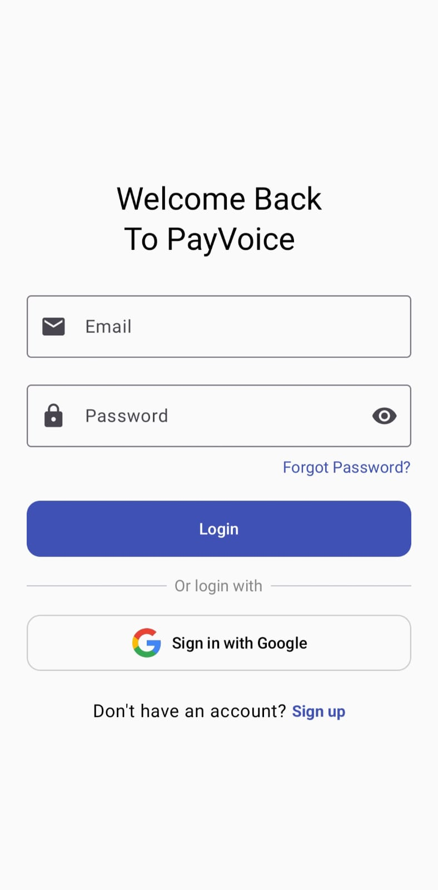
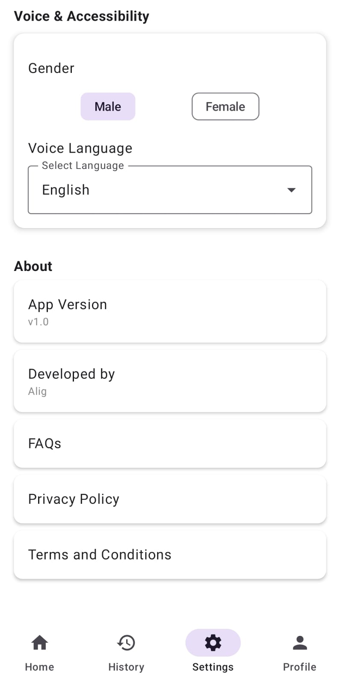

# 📢 PayVoice

**PayVoice** is an intelligent Android app that audibly announces your UPI payment notifications. It supports multiple UPI platforms and speaks out the transaction amount using your preferred **language** and **voice type** (Male/Female). Designed with privacy and performance in mind, it runs quietly in the background while keeping all your data local.

> 🎧 Your silent payment assistant — now with a voice!

---

## 📲 Features

- 🔊 Announces incoming UPI and SMS payments
- 🏦 Supports apps like Google Pay, PhonePe, Paytm
- 🌐 Multilingual: English and Hindi supported
- 👤 Voice Customization: Choose Male or Female voice
- 🛠️ Built with Jetpack Compose + Kotlin
- 📁 Local storage using Room Database
- ⚙️ Smart settings panel for preferences
- 🔋 Lightweight and battery-efficient

---

## 🖼️ Screenshots

> Make sure to upload your screenshots in a folder named `assets/` in your GitHub repo and update the image paths below.

| Login Screen | Home Page | Settings Page |
|-------------|----------------------------|----------------|
|  |  |  |

---

## 🚀 Getting Started

### 📦 Prerequisites

- Android Studio Giraffe or later
- Kotlin 1.9+
- Android SDK 23 or above
- Optional: Firebase account for analytics or crash reports

---

### 🛠️ Installation

1. **Clone the repository**

```bash
git clone https://github.com/Ariifff/payvoice.git
cd payvoice
```

2. Open the project in Android Studio

3. Add google-services.json file in app/ folder if you're using Firebase

4. Run the app on a device or emulator

---

### 📐 Architecture
- MVVM (Model-View-ViewModel)
- Jetpack Compose for UI
- Room for offline data storage
- Kotlin Coroutines + Flow
- SharedPreferences for storing language & voice settings
- Foreground service to capture notifications in the background

---

### 🔐 Permissions Used
**Permission Purpose**

- POST_NOTIFICATIONS	To read UPI app notifications
- FOREGROUND_SERVICE	To run voice service in background
- INTERNET	For downloading voice model if needed

🔒 Note: No sensitive data is collected or sent to servers. Everything remains on your device.

---

### 🌍 Language & Voice Options
**Languages:**

- English 🇬🇧
- Hindi 🇮🇳

**Voice Options:**

- Male
- Female
All customizable via the Settings screen inside the app.

---

### 🧑‍💻 Developer
Mohd Arif Rainee

📧 arifdevelopment1@gmail.com

--- 

### 🌟 Star the Repo
If you found this project helpful, consider leaving a ⭐ to support the development.


---

